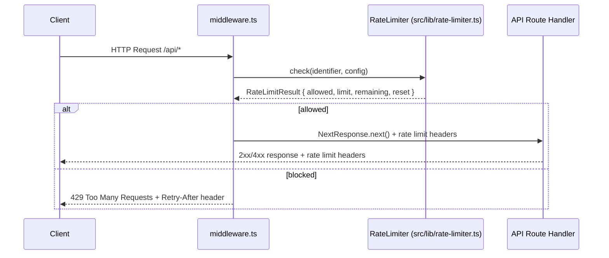

# Design Document: Rate Limiting

## Overview

Rate limiting is implemented as an in-process sliding-window counter that runs inside the existing Next.js edge middleware (`middleware.ts`). Every `/api/*` request is checked before versioning/routing logic executes. The counter state lives in a `Map` held in module scope — this is intentional for the edge runtime where a lightweight, zero-dependency store is required. Authenticated callers (Bearer token) get a separate, higher quota tracked by a redacted key identifier.

## Architecture



The middleware layer owns IP extraction, identifier selection (IP vs API key), logging, and header injection. The `RateLimiter` class is a pure, side-effect-free module that only manages counter state — making it straightforward to unit-test and property-test in isolation.

## Components and Interfaces

### `src/lib/rate-limiter.ts`

Core rate limiting logic. Exported as a singleton instance and as the class for testing.

```typescript
export interface RateLimitConfig {
  limit: number; // max requests per window
  windowSeconds: number; // window duration in seconds
}

export interface RateLimitResult {
  allowed: boolean;
  limit: number;
  remaining: number;
  resetAt: number; // Unix timestamp (seconds) when window resets
}

export class RateLimiter {
  check(identifier: string, config: RateLimitConfig): RateLimitResult;
  /** Exposed for testing — clears all counters */
  reset(): void;
}

export const rateLimiter: RateLimiter; // singleton
```

### `src/lib/rate-limit-config.ts`

Reads and validates environment variables, returning a resolved `ResolvedRateLimitConfig`.

```typescript
export interface ResolvedRateLimitConfig {
  unauthenticatedLimit: number; // default 100
  authenticatedLimit: number; // default 1000
  windowSeconds: number; // default 60
}

export function getRateLimitConfig(): ResolvedRateLimitConfig;
```

### `middleware.ts` (modified)

Adds rate limiting as the first step inside the `middleware` function, before existing versioning logic.

New helpers added inline or imported:

- `extractClientIp(request: NextRequest): string` — reads `x-forwarded-for` → `x-real-ip` → `"unknown"`
- `extractApiKey(request: NextRequest): string | null` — parses `Authorization: Bearer <token>`
- `logViolation(ip: string, identifier: string, path: string): void` — emits structured JSON log
- `addRateLimitHeaders(response: NextResponse, result: RateLimitResult): void` — sets the four headers

## Data Models

### Window Entry (internal to `RateLimiter`)

```typescript
interface WindowEntry {
  count: number;
  windowStart: number; // Unix timestamp (ms) when this window began
}
```

The `Map<string, WindowEntry>` is keyed by identifier. On each `check()` call:

1. If no entry exists, or `now >= windowStart + windowSeconds * 1000`, start a fresh window with `count = 1`.
2. Otherwise increment `count`.
3. Return `allowed = count <= limit`, `remaining = Math.max(0, limit - count)`, `resetAt = Math.floor((windowStart + windowSeconds * 1000) / 1000)`.

### Log Entry Shape

```typescript
interface ViolationLogEntry {
  event: "rate_limit_violation";
  ip: string;
  identifier: string; // IP address or redacted API key ("sk_live_ab12..." → "sk_live_ab...")
  path: string;
  timestamp: string; // ISO 8601 UTC
}
```

## Correctness Properties

_A property is a characteristic or behavior that should hold true across all valid executions of a system — essentially, a formal statement about what the system should do. Properties serve as the bridge between human-readable specifications and machine-verifiable correctness guarantees._

Property 1: Requests within limit are always allowed
_For any_ identifier and config where the number of calls to `check()` does not exceed `config.limit` within a single window, every result SHALL have `allowed = true`.
**Validates: Requirements 1.2, 1.5**

Property 2: Requests beyond limit are always blocked
_For any_ identifier and config, once `check()` has been called `config.limit + 1` times within the same window, the result SHALL have `allowed = false`.
**Validates: Requirements 1.3**

Property 3: Remaining never goes negative
_For any_ sequence of `check()` calls on the same identifier, the `remaining` field in every result SHALL satisfy `remaining >= 0`.
**Validates: Requirements 2.5**

Property 4: Remaining decrements correctly
_For any_ identifier and config, after `n` calls within the same window (where `n <= limit`), `remaining` SHALL equal `limit - n`.
**Validates: Requirements 2.2**

Property 5: Window reset restores full quota
_For any_ identifier that has exhausted its limit, after the window duration elapses, the next `check()` call SHALL return `allowed = true` and `remaining = limit - 1`.
**Validates: Requirements 1.1, 1.4**

Property 6: Authenticated limit is higher than unauthenticated limit
_For any_ resolved config, `authenticatedLimit > unauthenticatedLimit` SHALL hold.
**Validates: Requirements 3.2**

Property 7: Invalid env var values fall back to defaults
_For any_ environment where `RATE_LIMIT_UNAUTHENTICATED`, `RATE_LIMIT_AUTHENTICATED`, or `RATE_LIMIT_WINDOW_SECONDS` is set to a non-positive or non-numeric string, `getRateLimitConfig()` SHALL return the default values (100, 1000, 60).
**Validates: Requirements 5.4**

Property 8: IP extraction precedence
_For any_ request, `extractClientIp` SHALL return the first IP from `x-forwarded-for` when present, else the value of `x-real-ip`, else `"unknown"`.
**Validates: Requirements 6.3, 6.4**

Property 9: API key redaction preserves first 8 characters
_For any_ API key string of length ≥ 8, the redacted form used in log entries SHALL start with the first 8 characters of the key followed by `"..."`.
**Validates: Requirements 4.3**

## Error Handling

- If `getRateLimitConfig()` encounters an unparseable env var it logs a warning and uses the default — it never throws.
- If `extractClientIp` cannot find any IP header it returns `"unknown"` — rate limiting still applies.
- The `RateLimiter.check()` method is synchronous and does not throw; all error paths return a safe default result.
- A 429 response body follows the existing `StandardErrorResponse` shape: `{ error: "RATE_LIMITED", message: "Too many requests. Please retry after <N> seconds." }`.

## Testing Strategy

### Unit Tests (`src/test/rate-limiter.test.ts`, `src/test/rate-limit-config.test.ts`)

Focus on specific examples and edge cases:

- Exactly at the limit (boundary: `count === limit` → allowed)
- One over the limit (`count === limit + 1` → blocked)
- Window expiry resets the counter
- `x-forwarded-for` with multiple IPs (comma-separated) — first IP is used
- Missing IP headers → `"unknown"`
- `Authorization: Bearer token` → key extracted
- `Authorization: Basic ...` → treated as unauthenticated
- Env var `"0"`, `"-5"`, `"abc"` → defaults used

### Property-Based Tests (`src/test/rate-limiter.property.test.ts`)

Use **fast-check** (to be added as a dev dependency) for universal property coverage.

Each property test runs a minimum of **100 iterations**.

Tag format: `Feature: rate-limiting, Property <N>: <property_text>`

- **Property 1** — generate random `(identifier, limit, callCount ≤ limit)` → all results allowed
- **Property 2** — generate random `(identifier, limit)`, call `limit + 1` times → last result blocked
- **Property 3** — generate random call sequences → `remaining` is always `≥ 0`
- **Property 4** — generate random `(identifier, limit, n ≤ limit)` → `remaining === limit - n`
- **Property 5** — exhaust limit, advance clock past window → next call allowed with full quota
- **Property 7** — generate random invalid env strings → config always returns defaults
- **Property 8** — generate requests with various header combinations → IP extraction follows precedence
- **Property 9** — generate random API key strings (length ≥ 8) → redacted form starts with first 8 chars + `"..."`

Both unit and property tests are complementary: unit tests catch concrete boundary bugs; property tests verify general correctness across the input space.
