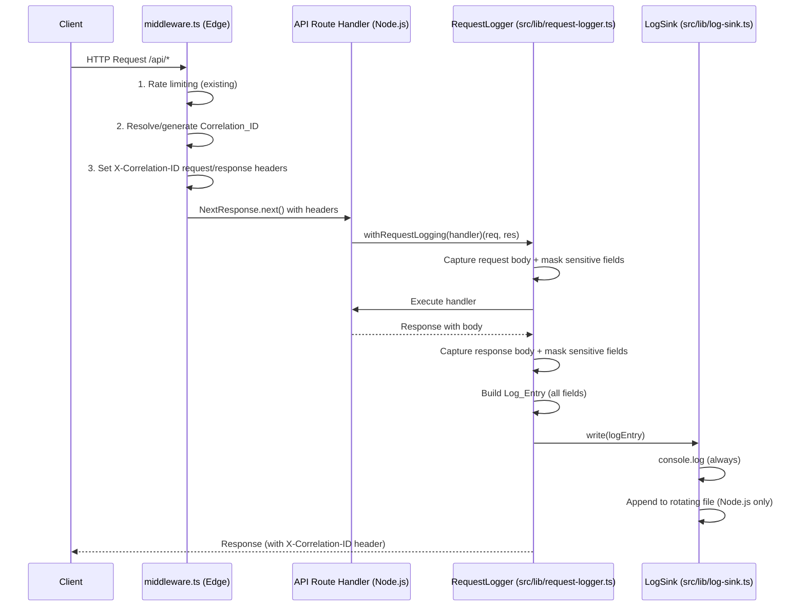

# Design Document: Request Logging

## Overview

Request logging is implemented as a two-layer system. A thin edge-compatible layer inside `middleware.ts` handles Correlation_ID generation and header propagation. A Node.js-compatible logger module (`src/lib/request-logger.ts`) handles body capture, sensitive-field masking, structured JSON emission, and rotating file output. Because the Next.js edge runtime does not support Node.js file-system APIs, the file-sink and rotation logic lives in a separate `src/lib/log-sink.ts` module that is only imported from API route wrappers and server-side code — never from `middleware.ts` itself.

The middleware emits a minimal log entry (method, path, correlation ID, timestamp) via `console.log` for edge-compatible environments. Full body capture and file logging are handled by a `withRequestLogging` higher-order function that wraps API route handlers in the Node.js runtime.

## Architecture



## Components and Interfaces

### `src/lib/correlation-id.ts` (Edge-compatible)

UUID v4 generation and validation using the Web Crypto API — safe for the edge runtime.

```typescript
/** Generates a UUID v4 using crypto.randomUUID() (Web Crypto API). */
export function generateCorrelationId(): string;

/** Returns true if the value is a valid UUID v4. */
export function isValidCorrelationId(value: string): boolean;
```

### `src/lib/sensitive-mask.ts` (Edge-compatible)

Recursive sensitive-field masking. Pure function with no I/O.

```typescript
/** Default set of sensitive field names (case-insensitive). */
export const SENSITIVE_KEYS: ReadonlySet<string>;

/**
 * Recursively masks sensitive fields in a parsed JSON value.
 * Returns a new object — does not mutate the input.
 */
export function maskSensitiveFields(value: unknown): unknown;
```

### `src/lib/request-logger.ts` (Node.js runtime)

Core logging logic. Builds `Log_Entry` objects and delegates to `LogSink`.

```typescript
export interface LogEntry {
  correlationId: string | null;
  method: string;
  path: string;
  query: string | null;
  statusCode: number;
  durationMs: number;
  timestamp: string; // ISO 8601 UTC
  requestBody: unknown | null;
  responseBody: unknown | null;
  // Present only when LOG_LEVEL=debug
  requestHeaders?: Record<string, string>;
  responseHeaders?: Record<string, string>;
}

export interface RequestLoggerConfig {
  maxBodyBytes: number; // default 10_240 (10 KB)
  logLevel: "info" | "debug";
}

export function getLoggerConfig(): RequestLoggerConfig;

/**
 * Higher-order function that wraps a Next.js API route handler with
 * full request/response logging.
 */
export function withRequestLogging<T>(
  handler: (req: NextApiRequest, res: NextApiResponse<T>) => Promise<void>,
): (req: NextApiRequest, res: NextApiResponse<T>) => Promise<void>;
```

### `src/lib/log-sink.ts` (Node.js runtime)

Handles console output and rotating file writes. Uses `winston` with `winston-daily-rotate-file`.

```typescript
export interface LogSinkConfig {
  logDir: string; // default "logs"
  maxFileSizeMB: number; // default 10
  maxFiles: number; // default 7
}

export function getSinkConfig(): LogSinkConfig;

/** Writes a log entry to all configured sinks (console + rotating file). */
export function writeLogEntry(entry: LogEntry): void;
```

### `middleware.ts` (modified — edge-compatible additions only)

Adds Correlation_ID resolution as step 2 (after rate limiting, before versioning).

New helpers added:

- `resolveCorrelationId(request: NextRequest): string` — reads `X-Correlation-ID` header; validates UUID v4; generates a new one if absent or invalid.
- Injects `X-Correlation-ID` into both the forwarded request headers and the response headers.

## Data Models

### Log Entry (full shape)

```typescript
interface LogEntry {
  correlationId: string | null;
  method: string; // "GET", "POST", etc.
  path: string; // pathname only, no query string
  query: string | null; // raw query string or null
  statusCode: number;
  durationMs: number; // wall-clock ms from request receipt to response send
  timestamp: string; // ISO 8601 UTC, e.g. "2025-01-15T10:30:00.000Z"
  requestBody: unknown | null; // masked JSON or null
  responseBody: unknown | null; // masked JSON or null
  // debug only:
  requestHeaders?: Record<string, string>; // Authorization masked
  responseHeaders?: Record<string, string>;
}
```

### Masked Body Rules

1. Parse body string as JSON. If parsing fails → `null`.
2. If parsed size (JSON.stringify) > `maxBodyBytes` → `"[TRUNCATED]"`.
3. Otherwise → `maskSensitiveFields(parsed)`.

### Sensitive Key Set (default)

```
password, token, authorization, cardnumber, cvv, ssn, secret, apikey, api_key
```

All comparisons are lower-cased before matching.

### Log File Naming

```
{logDir}/api-requests-YYYY-MM-DD.log
```

Rotation triggers: file size ≥ 10 MB. Retention: 7 files max.

## Correctness Properties

_A property is a characteristic or behavior that should hold true across all valid executions of a system — essentially, a formal statement about what the system should do. Properties serve as the bridge between human-readable specifications and machine-verifiable correctness guarantees._

---

Property 1: Log entry contains all required fields
_For any_ API request/response pair, the emitted Log_Entry SHALL contain non-null values for `correlationId`, `method`, `path`, `statusCode`, `durationMs`, and `timestamp`, and SHALL contain (possibly null) values for `query`, `requestBody`, and `responseBody`.
**Validates: Requirements 1.1, 1.2, 2.4, 5.2**

Property 2: Log entry is valid single-line JSON
_For any_ Log_Entry emitted by the Request_Logger, the string written to the sink SHALL be parseable as JSON and SHALL contain no newline characters before the terminating newline.
**Validates: Requirements 5.1**

Property 3: Absent fields are null, not omitted
_For any_ Log_Entry where a field value is not applicable (e.g. no request body), that field SHALL be present in the JSON output with value `null` rather than absent.
**Validates: Requirements 5.5**

Property 4: Sensitive fields are always masked
_For any_ JSON object at any nesting depth containing a key from the Sensitive_Field list (case-insensitive), after applying `maskSensitiveFields`, every such key's value SHALL equal `"[REDACTED]"`.
**Validates: Requirements 3.1, 3.3, 3.5, 3.6**

Property 5: Non-sensitive fields are preserved
_For any_ JSON object, after applying `maskSensitiveFields`, every key not in the Sensitive_Field list SHALL have the same value as in the original object.
**Validates: Requirements 3.4**

Property 6: Correlation ID is generated when absent
_For any_ request without an `X-Correlation-ID` header, `resolveCorrelationId` SHALL return a string that satisfies `isValidCorrelationId`.
**Validates: Requirements 2.1**

Property 7: Valid Correlation ID is passed through unchanged
_For any_ request carrying a valid UUID v4 in `X-Correlation-ID`, `resolveCorrelationId` SHALL return that exact value.
**Validates: Requirements 2.2**

Property 8: Correlation ID is always present in response header
_For any_ API request (with or without an incoming `X-Correlation-ID` header), the response SHALL include an `X-Correlation-ID` header whose value satisfies `isValidCorrelationId`.
**Validates: Requirements 2.3**

Property 9: Bodies exceeding 10 KB are truncated
_For any_ request or response body whose JSON-serialised size exceeds 10 240 bytes, the `requestBody` or `responseBody` field in the Log_Entry SHALL equal `"[TRUNCATED]"`.
**Validates: Requirements 1.5** _(edge case)_

Property 10: Invalid JSON bodies become null
_For any_ request or response body string that is not valid JSON, the corresponding body field in the Log_Entry SHALL be `null`.
**Validates: Requirements 1.6** _(edge case)_

Property 11: Invalid Correlation IDs are replaced
_For any_ request carrying a non-UUID-v4 string in `X-Correlation-ID`, `resolveCorrelationId` SHALL return a freshly generated UUID v4 that is different from the invalid input.
**Validates: Requirements 2.5** _(edge case)_

## Error Handling

- `maskSensitiveFields` never throws; if the input is not a plain object or array it is returned as-is.
- `withRequestLogging` wraps the handler in a try/catch; if body capture or logging fails, the error is emitted as a structured `{ event: "request_logger_error", error: message }` log entry and the original response is returned unchanged.
- `writeLogEntry` catches file-write errors and falls back to `console.error` — it never propagates exceptions to the caller.
- `resolveCorrelationId` catches any `crypto.randomUUID()` failure and falls back to a timestamp-based fallback ID.
- If `LOG_DIR` does not exist, `log-sink.ts` creates it with `fs.mkdirSync(dir, { recursive: true })` before the first write.

## Testing Strategy

### Unit Tests

Focus on specific examples and edge cases:

- `correlation-id.ts`: `generateCorrelationId()` returns a valid UUID v4; `isValidCorrelationId` rejects non-UUID strings, accepts valid ones.
- `sensitive-mask.ts`: each named sensitive key is masked; nested objects masked; arrays with sensitive keys masked; non-sensitive keys unchanged; case-insensitive matching (`PASSWORD`, `Token`).
- `request-logger.ts`: body > 10 KB → `"[TRUNCATED]"`; invalid JSON → `null`; `LOG_LEVEL=debug` adds header fields; missing body → `null`.
- `log-sink.ts`: `getSinkConfig()` reads `LOG_DIR` env var; falls back to `"logs"` when absent.

### Property-Based Tests (fast-check)

Use **fast-check** for universal property coverage. Minimum **100 iterations** per property.

Tag format: `Feature: request-logging, Property <N>: <property_text>`

- **Property 1** — generate random `(method, path, statusCode, durationMs)` tuples → log entry contains all required fields — `Feature: request-logging, Property 1`
- **Property 2** — generate random log entries → serialised string is valid JSON with no embedded newlines — `Feature: request-logging, Property 2`
- **Property 3** — generate log entries with missing optional fields → all fields present as `null` — `Feature: request-logging, Property 3`
- **Property 4** — generate random nested JSON objects with sensitive keys at random depths → all sensitive values equal `"[REDACTED]"` — `Feature: request-logging, Property 4`
- **Property 5** — generate random JSON objects → non-sensitive fields unchanged after masking — `Feature: request-logging, Property 5`
- **Property 6** — generate random requests without `X-Correlation-ID` → result is valid UUID v4 — `Feature: request-logging, Property 6`
- **Property 7** — generate random valid UUID v4 strings → passed through unchanged — `Feature: request-logging, Property 7`
- **Property 8** — generate random requests (with/without header) → response always has valid UUID v4 in `X-Correlation-ID` — `Feature: request-logging, Property 8`
- **Property 9** — generate bodies > 10 240 bytes → body field equals `"[TRUNCATED]"` — `Feature: request-logging, Property 9` _(edge case)_
- **Property 10** — generate random non-JSON strings → body field is `null` — `Feature: request-logging, Property 10` _(edge case)_
- **Property 11** — generate random non-UUID strings → `resolveCorrelationId` returns a valid UUID v4 — `Feature: request-logging, Property 11` _(edge case)_

Both unit and property tests are complementary: unit tests catch concrete boundary bugs; property tests verify general correctness across the input space.
