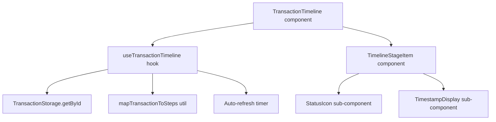

# Design Document: Transaction Timeline

## Overview

The transaction timeline is a React component (`TransactionTimeline`) that renders a vertical, ordered list of all offramp stages with their status, timestamp, and description. It integrates with the existing `TransactionStorage`, `OfframpStep` type, and polling infrastructure already present in the codebase. Auto-refresh is implemented via a `useInterval`-style hook that re-reads `TransactionStorage` and re-derives display state on each tick, stopping automatically when a terminal state is reached.

## Architecture



The component is purely client-side (`"use client"`), consistent with all other interactive components in the codebase. It does not introduce new API routes — it reads from `TransactionStorage` (localStorage) and optionally re-fetches from `/api/transactions` for server-side data.

## Components and Interfaces

### `TransactionTimeline` (main component)

```tsx
// src/components/TransactionTimeline.tsx
export interface TransactionTimelineProps {
  transactionId: string;
  refreshIntervalMs?: number; // default: 5000
}
```

Renders the full timeline. Delegates data fetching to `useTransactionTimeline`.

### `useTransactionTimeline` (hook)

```tsx
// src/hooks/useTransactionTimeline.ts
export interface UseTransactionTimelineResult {
  entries: TimelineEntry[];
  currentStep: OfframpStep;
  isTerminal: boolean;
  transaction: Transaction | null;
  error: string | null;
}

export function useTransactionTimeline(
  transactionId: string,
  refreshIntervalMs: number,
): UseTransactionTimelineResult;
```

- Reads `TransactionStorage.getById(transactionId)` on mount and on each refresh tick.
- Calls `mapTransactionToSteps(transaction)` to derive `TimelineEntry[]`.
- Sets up a `setInterval` that clears itself when `isTerminal` becomes true or on unmount.

### `TimelineEntry` (data model)

```tsx
// src/types/stellaramp.ts (extend existing file)
export interface TimelineEntry {
  step: OfframpStep;
  label: string;
  status: "pending" | "active" | "completed" | "error";
  description: string;
  timestamp: number | null; // Unix ms, null if not yet reached
}
```

### `mapTransactionToSteps` (utility)

```tsx
// src/lib/timeline-utils.ts
export function mapTransactionToSteps(
  transaction: Transaction | null,
): TimelineEntry[];
```

Converts a `Transaction` record into an ordered array of `TimelineEntry` objects by:

1. Mapping `transaction.status` → overall `OfframpStep`
2. Mapping `transaction.bridgeStatus` → bridge-phase step
3. Mapping `transaction.payoutStatus` → payout-phase step
4. Assigning `status: 'completed' | 'active' | 'pending' | 'error'` to each entry
5. Populating `timestamp` from stored stage timestamps (see Data Models)

### `TimelineStageItem` (sub-component)

Renders a single stage row: icon, label, description, timestamp. Accepts a `TimelineEntry` and an `isCurrent` boolean.

## Data Models

### Extended `Transaction` type

The existing `Transaction` interface in `src/lib/transaction-storage.ts` needs stage timestamps added:

```ts
export interface Transaction {
  // ... existing fields ...
  stageTimestamps?: Partial<Record<OfframpStep, number>>; // Unix ms per stage
}
```

`TransactionStorage.update()` is called with `stageTimestamps` whenever a step transition occurs (this is done by the existing wallet flow — the timeline hook reads it, not writes it).

### Stage ordering constant

```ts
// src/lib/timeline-utils.ts
export const TIMELINE_STAGES: OfframpStep[] = [
  "initiating",
  "awaiting-signature",
  "submitting",
  "processing",
  "settling",
  "success",
];
```

### Stage metadata

```ts
export interface StageMeta {
  label: string;
  descriptions: {
    pending: string;
    active: string;
    completed: string;
  };
}

export const STAGE_META: Record<OfframpStep, StageMeta> = {
  initiating: {
    label: "Initiating",
    descriptions: {
      pending: "Waiting to begin…",
      active: "Preparing your transaction details…",
      completed: "Transaction initiated.",
    },
  },
  "awaiting-signature": {
    label: "Awaiting Signature",
    descriptions: {
      pending: "Waiting for wallet approval…",
      active: "Please approve the transaction in your wallet.",
      completed: "Signature received.",
    },
  },
  submitting: {
    label: "Submitting",
    descriptions: {
      pending: "Waiting to submit…",
      active: "Broadcasting to the Stellar network…",
      completed: "Submitted to network.",
    },
  },
  processing: {
    label: "Processing",
    descriptions: {
      pending: "Waiting for confirmation…",
      active: "Waiting for on-chain confirmation…",
      completed: "Confirmed on-chain.",
    },
  },
  settling: {
    label: "Settling",
    descriptions: {
      pending: "Waiting for fiat payout…",
      active: "Transferring funds to your bank account…",
      completed: "Funds sent to bank.",
    },
  },
  success: {
    label: "Complete",
    descriptions: {
      pending: "—",
      active: "Transaction complete.",
      completed: "Funds have been sent to your bank account.",
    },
  },
  error: {
    label: "Failed",
    descriptions: {
      pending: "—",
      active: "Transaction failed.",
      completed: "—",
    },
  },
  idle: {
    label: "Idle",
    descriptions: { pending: "—", active: "—", completed: "—" },
  },
};
```

## Correctness Properties

_A property is a characteristic or behavior that should hold true across all valid executions of a system — essentially, a formal statement about what the system should do. Properties serve as the bridge between human-readable specifications and machine-verifiable correctness guarantees._

Property 1: Stage order is preserved
_For any_ `Transaction` record, `mapTransactionToSteps` SHALL return entries in the fixed `TIMELINE_STAGES` order, regardless of the transaction's current step.
**Validates: Requirements 1.1**

Property 2: Exactly one active stage
_For any_ non-terminal, non-idle `Transaction`, the entries returned by `mapTransactionToSteps` SHALL contain exactly one entry with `status === 'active'`.
**Validates: Requirements 1.5**

Property 3: All stages before active are completed
_For any_ `Transaction` in a non-terminal state, every entry that precedes the active entry in the ordered list SHALL have `status === 'completed'`.
**Validates: Requirements 1.6**

Property 4: All stages after active are pending
_For any_ `Transaction` in a non-terminal state, every entry that follows the active entry in the ordered list SHALL have `status === 'pending'`.
**Validates: Requirements 1.4**

Property 5: Timestamp present iff stage reached
_For any_ `TimelineEntry`, `timestamp` SHALL be non-null if and only if `status` is `'completed'` or `'active'`.
**Validates: Requirements 2.1, 2.2**

Property 6: Auto-refresh stops at terminal state
_For any_ `Transaction` that reaches `status === 'completed'` or `status === 'failed'`, the `useTransactionTimeline` hook SHALL not schedule any further refresh ticks after detecting the terminal state.
**Validates: Requirements 4.3**

Property 7: mapTransactionToSteps is total
_For any_ `Transaction` value (including null), `mapTransactionToSteps` SHALL return a non-empty array of `TimelineEntry` objects without throwing.
**Validates: Requirements 5.2**

Property 8: Error description propagation
_For any_ `Transaction` with `status === 'failed'` and a non-empty `error` field, the `TimelineEntry` for the `error` step SHALL have its `description` equal to `transaction.error`.
**Validates: Requirements 3.5**

## Error Handling

- If `TransactionStorage.getById` returns `undefined`, the hook sets `error: "Transaction not found"` and `entries` to the full stage list with all entries in `pending` status.
- If the auto-refresh fetch throws (network error), the hook retains the last known state and does not crash.
- The component renders an inline error message when `error` is non-null.

## Testing Strategy

### Unit tests (Vitest + React Testing Library)

- `mapTransactionToSteps`: test with null, pending, each active step, success, error transactions.
- `TransactionTimeline` component: renders all stages, shows active stage highlighted, shows timestamps, shows error state, shows empty state.
- `useTransactionTimeline` hook: verify polling starts on mount, stops on terminal state, clears on unmount.

### Property-based tests (fast-check via Vitest)

The project uses Vitest. We will add `fast-check` as a dev dependency for property-based testing.

Each property test runs a minimum of 100 iterations.

- **Property 1** — `mapTransactionToSteps` output order matches `TIMELINE_STAGES` for all generated `Transaction` inputs.
  Tag: `Feature: transaction-timeline, Property 1: stage order is preserved`

- **Property 2** — For all non-terminal transactions, exactly one entry has `status === 'active'`.
  Tag: `Feature: transaction-timeline, Property 2: exactly one active stage`

- **Property 3** — For all non-terminal transactions, all entries before active have `status === 'completed'`.
  Tag: `Feature: transaction-timeline, Property 3: all stages before active are completed`

- **Property 4** — For all non-terminal transactions, all entries after active have `status === 'pending'`.
  Tag: `Feature: transaction-timeline, Property 4: all stages after active are pending`

- **Property 5** — For all entries, timestamp is non-null iff status is completed or active.
  Tag: `Feature: transaction-timeline, Property 5: timestamp present iff stage reached`

- **Property 6** — After hook detects terminal state, no further interval callbacks fire.
  Tag: `Feature: transaction-timeline, Property 6: auto-refresh stops at terminal state`

- **Property 7** — `mapTransactionToSteps(null)` and `mapTransactionToSteps(anyTransaction)` never throw and always return a non-empty array.
  Tag: `Feature: transaction-timeline, Property 7: mapTransactionToSteps is total`

- **Property 8** — For all failed transactions with an error string, the error entry description equals `transaction.error`.
  Tag: `Feature: transaction-timeline, Property 8: error description propagation`
