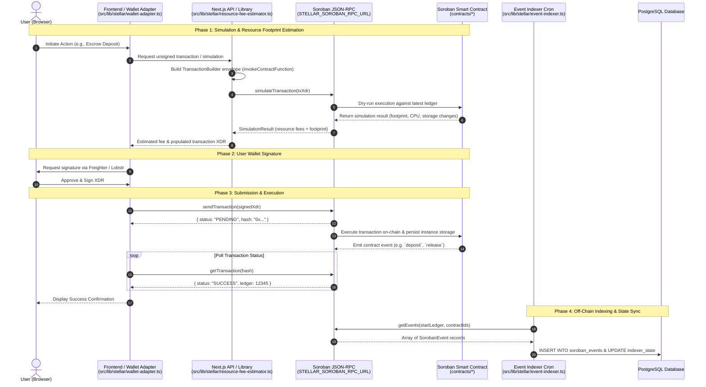

# ADR: Stellar Contract Integration Architecture

**Status:** Accepted  
**Date:** 2026-08-25  
**Deciders:** Stellar-Spend Core Team  

---

## Context

The `contracts/` directory contains four Soroban smart contracts written in Rust:
1. `escrow`: Non-custodial deposit state management, release authorization, and permissionless refund timers.
2. `fee-manager`: Flat fee calculation and emergency operational pause switch (circuit breaker).
3. `multisig-authority`: On-chain M-of-N threshold signing and quorum verification for high-value operations.
4. `treasury`: Tiered fee policy schedules and treasury recipient routing.

Per [ADR-012 (Contract Architecture)](./ADR-012-contract-architecture.md), **contracts do not call each other on-chain**. Instead, all cross-contract orchestration, transaction construction, authorization handling, and state synchronization are driven off-chain through the Next.js application layer (`src/lib` and `src/app/api`).

This document details how `src/lib` integrates with these Soroban contracts via the Soroban JSON-RPC, the client-to-contract call flow, and the configuration and environment variables required for each contract.

---

## Off-Chain Integration Architecture

The TypeScript integration layer in `src/lib` bridges browser wallets and backend services with the deployed Soroban contracts.

```
┌─────────────────────────────────────────────────────────────────────────────┐
│                            User Browser                                     │
│  ┌───────────────────────┐              ┌────────────────────────────────┐  │
│  │ React UI / Components │              │ Wallet (Freighter / Lobstr)    │  │
│  └───────────┬───────────┘              └───────────────┬────────────────┘  │
└──────────────┼──────────────────────────────────────────┼───────────────────┘
               │ HTTP API                                 │ Sign Transaction
               ▼                                          ▼
┌─────────────────────────────────────────────────────────────────────────────┐
│                       Next.js App Layer (`src/lib`)                         │
│  ┌────────────────────────┐  ┌───────────────────────┐  ┌────────────────┐  │
│  │ Wallet Adapter         │  │ Resource Fee Estimator│  │ Multisig       │  │
│  │ src/lib/stellar/       │  │ src/lib/stellar/      │  │ Settlement Svc │  │
│  │   wallet-adapter.ts    │  │   resource-fee-       │  │ src/lib/       │  │
│  │                        │  │   estimator.ts        │  │ multisig-...ts │  │
│  └────────────────────────┘  └───────────────────────┘  └────────────────┘  │
│  ┌────────────────────────┐  ┌───────────────────────┐  ┌────────────────┐  │
│  │ Event Indexer          │  │ Environment Config    │  │ DB Persistence │  │
│  │ src/lib/stellar/       │  │ src/lib/env.ts        │  │ PostgreSQL     │  │
│  │   event-indexer.ts     │  │                       │  │ (events/audit) │  │
│  └───────────┬────────────┘  └───────────────────────┘  └────────────────┘  │
└──────────────┼──────────────────────────────────────────────────────────────┘
               │ JSON-RPC (simulateTransaction, sendTransaction, getEvents)
               ▼
┌─────────────────────────────────────────────────────────────────────────────┐
│                       Stellar Soroban RPC Node                              │
└──────────────────────────────────────┬──────────────────────────────────────┘
                                       │ Execute WASM
                                       ▼
┌─────────────────────────────────────────────────────────────────────────────┐
│                             Soroban Contracts                               │
│  ┌────────────┐     ┌──────────────┐     ┌──────────────┐     ┌───────────┐ │
│  │   escrow   │     │  fee-manager │     │ multisig-auth│     │  treasury │ │
│  └────────────┘     └──────────────┘     └──────────────┘     └───────────┘ │
└─────────────────────────────────────────────────────────────────────────────┘
```

### Core Subsystems in `src/lib`

1. **Wallet Adapter (`src/lib/stellar/wallet-adapter.ts`):**
   - Connects to browser wallet extensions (Freighter, Lobstr).
   - Requests user authorization and signature over Soroban contract transaction envelopes (XDR).

2. **Resource & Fee Estimator (`src/lib/stellar/resource-fee-estimator.ts`):**
   - Builds transaction envelopes with `Operation.invokeContractFunction`.
   - Simulates invocations against Soroban RPC to obtain footprint reads/writes, CPU instructions, and memory limits before prompting user signing or server submission.

3. **Multisig Coordinator (`src/lib/multisig-settlement.ts` & `src/lib/stellar/multisig.ts`):**
   - Coordinates off-chain collection and validation of M-of-N cryptographic signatures.
   - Enforces the `highValueLimit` rule: transfers below threshold proceed with a single signature, whereas high-value actions require full quorum before triggering on-chain execution.
   - Logs signature trails into PostgreSQL for compliance.

4. **Event Indexer (`src/lib/stellar/event-indexer.ts`):**
   - Ingests on-chain events emitted by contract invocations (`deposit`, `release`, `refund`, `fee_collected`, `proposal_signed`).
   - Executed via periodic cron (`src/app/api/cron/soroban-event-sync.ts`) to synchronize smart contract state into the application database.

---

## Call Flow Diagrams

### 1. Client -> Soroban RPC -> Contract Call Sequence

The following sequence diagram details the lifecycle of a contract invocation, from pre-flight simulation and resource estimation, to wallet signing, RPC broadcast, and asynchronous event indexing.



---

## Contract Integration Details

### 1. Escrow Contract (`contracts/escrow`)

- **Primary Entry Points:**
  - `deposit(depositor: Address, amount: i128, bridge: String, token: Address)`: Creates an escrow deposit locked until timeout. Requires `depositor.require_auth()`.
  - `release(deposit_id: String, recipient: Address)`: Releases deposit to beneficiary/bridge. Requires `settlement_authority.require_auth()`.
  - `refund(deposit_id: String)`: Permissionless refund to depositor once `current_ledger >= timeout_ledger`.
  - `set_timeout(deposit_id: String, timeout_ledger: u32)`: Adjusts dispute timeout. Requires `settlement_authority.require_auth()`.
- **Integration Flow:**
  - **Client-Side:** The user initiates `deposit` through `wallet-adapter.ts`.
  - **Server-Side:** When off-ramp settlement completes on Base / Paycrest, the Next.js server signs and submits `release` using the settlement authority secret key.
  - **Fallback / Dispute:** If settlement stalls, the user calls `refund` directly via their wallet once the timeout ledger passes.

### 2. Fee Manager Contract (`contracts/fee-manager`)

- **Primary Entry Points:**
  - `calculate_fee(amount: i128, fee_rate: u32) -> i128`: Pure fee arithmetic applying basis points (`fee_rate <= 500`). Rejects execution if contract is paused.
  - `pause(admin: Address)`: Emergency halt of fee operations. Requires `admin.require_auth()`.
  - `unpause(admin: Address)`: Resumes operations. Requires `admin.require_auth()`.
  - `migrate() -> u32`: Admin-triggered schema migration.
- **Integration Flow:**
  - **Server-Side:** API routes simulate `calculate_fee` prior to transaction construction to ensure the circuit breaker is active and fee math is verified.
  - **Admin Operations:** Management routes trigger `pause`/`unpause` during maintenance or incident response.

### 3. Multisig Authority Contract (`contracts/multisig-authority`)

- **Primary Entry Points:**
  - `propose(proposer: Address, id: String, target: Address, value: i128) -> u32`: Registers a high-value proposal.
  - `sign(signer: Address, id: String) -> u32`: Submits a co-signature for proposal `id`.
  - `execute(executor: Address, id: String) -> i128`: Executes proposal once `threshold` quorum is reached.
  - `add_signer`, `remove_signer`, `set_threshold`: Admin entry points for quorum management.
- **Integration Flow:**
  - `src/lib/multisig-settlement.ts` gathers off-chain signatures from co-signers via REST API.
  - When quorum is met, the coordinator invokes `execute` on the smart contract to authorize release or contract upgrades.

### 4. Treasury Contract (`contracts/treasury`)

- **Primary Entry Points:**
  - `get_fee_for_amount(amount: i128) -> u32`: Reads the stored tiered fee schedule.
  - `collect_fee(amount: i128, recipient: Address) -> i128`: Calculates fee for amount and emits fee collection event.
  - `set_fee_schedule(tiers: Map<u64, u32>)`: Updates tier thresholds and rates. Requires `admin.require_auth()`.
  - `update_treasury(new_treasury: Address)`: Updates payout destination.
- **Integration Flow:**
  - Off-ramp quote engine queries `get_fee_for_amount` to determine applicable basis points for the requested transfer volume.
  - Admin tools maintain fee tiers using `set_fee_schedule`.

---

## Environment Variables Matrix per Contract

The table below lists all required and optional environment variables necessary to operate each contract integration.

| Contract / Subsystem | Environment Variable | Scope | Required | Default / Example | Purpose |
| :--- | :--- | :--- | :---: | :--- | :--- |
| **Global Stellar** | `STELLAR_SOROBAN_RPC_URL` | Server | Yes | `https://soroban-rpc.mainnet.stellar.gateway.fm` | Soroban JSON-RPC endpoint for server-side simulation & submission |
| **Global Stellar** | `NEXT_PUBLIC_STELLAR_SOROBAN_RPC_URL` | Browser | Yes | `https://soroban-rpc.mainnet.stellar.gateway.fm` | Browser-accessible Soroban RPC for client wallet queries |
| **Global Stellar** | `STELLAR_HORIZON_URL` | Server | Yes | `https://horizon.stellar.org` | Horizon endpoint for account balance and sequence lookups |
| **Global Stellar** | `STELLAR_NETWORK_PASSPHRASE` | Both | No | `Public Global Stellar Network ; September 2015` | Network passphrase for transaction signature verification |
| **Escrow** | `ESCROW_CONTRACT_ID` | Both | Yes | `C...` (56-character Soroban contract ID) | Deployed Escrow contract address |
| **Escrow** | `STELLAR_SETTLEMENT_SECRET_KEY` | Server | Yes | `S...` (Ed25519 Secret Key) | Keypair for settlement authority authorized to call `release` |
| **Escrow** | `DEFAULT_TIMEOUT_LEDGERS` | Server | No | `604800` (~7 days) | Default ledger duration before deposits become refundable |
| **Fee Manager** | `FEE_MANAGER_CONTRACT_ID` | Both | Yes | `C...` | Deployed Fee Manager contract address |
| **Fee Manager** | `STELLAR_FEE_MANAGER_ADMIN_SECRET` | Server | Yes | `S...` | Admin key to invoke `pause`, `unpause`, and `migrate` |
| **Multisig Authority** | `MULTISIG_CONTRACT_ID` | Both | Yes | `C...` | Deployed Multisig Authority contract address |
| **Multisig Authority** | `MULTISIG_SIGNER_KEYS` | Server | Yes | `S...,S...` (comma-separated secrets) | Active keys for authorized signing coordinators |
| **Multisig Authority** | `MULTISIG_THRESHOLD` | Server | No | `2` | Minimum quorum count ($M$) for high-value actions |
| **Multisig Authority** | `MULTISIG_HIGH_VALUE_LIMIT` | Server | No | `1000000000` ($100 USDC in stroops) | Threshold above which full quorum is required |
| **Treasury** | `TREASURY_CONTRACT_ID` | Both | Yes | `C...` | Deployed Treasury contract address |
| **Treasury** | `STELLAR_TREASURY_ADMIN_SECRET` | Server | Yes | `S...` | Admin key for updating fee schedule and treasury destination |
| **Treasury** | `STELLAR_TREASURY_PAYOUT_ADDRESS` | Server | Yes | `G...` / `C...` | Destination address for accrued network fees |
| **Event Indexer** | `DATABASE_URL` | Server | Yes | `postgresql://...` | Database connection string for storing `soroban_events` |
| **Event Indexer** | `CRON_SECRET` | Server | Yes | `secret_token` | Bearer token protecting `/api/cron/soroban-event-sync` |

> [!WARNING]
> Secret keys (`STELLAR_SETTLEMENT_SECRET_KEY`, `STELLAR_FEE_MANAGER_ADMIN_SECRET`, `STELLAR_TREASURY_ADMIN_SECRET`, `MULTISIG_SIGNER_KEYS`) must **never** be prefixed with `NEXT_PUBLIC_` or exposed in client bundles. `src/lib/env.ts` actively rejects builds if secret keys are exposed to the frontend.

---

## Error Handling & Status Codes

All four contracts emit standard errors conforming to `stellar_spend_shared::errors::ContractError`. When invoking contracts from `src/lib`, RPC error responses decode into the following canonical error discriminants:

| Error Code | Error Variant | Description | Recommended `src/lib` Action |
| :--- | :--- | :--- | :--- |
| `1` | `Unauthorized` | Caller lacks `require_auth` permission | Reject with HTTP 403 / alert signing key mismatch |
| `2` | `AlreadyExists` | Deposit or proposal ID already recorded | Return duplicate state / idempotency replay |
| `3` | `NotFound` | Specified deposit or proposal does not exist | Return HTTP 404 |
| `4` | `Expired` | Proposal TTL or timeout passed | Invalidate cache / mark transaction expired |
| `5` | `InvalidState` | Action invalid in current state (e.g. double release) | Invalidate optimistic state |
| `6` | `InsufficientBalance` | Insufficient token or gas balance | Prompt user to fund account |
| `7` | `InvalidAmount` | Zero or negative amount passed | Reject in client validation before simulation |
| `8` | `Paused` | Fee manager or operational pause flag set | Fail fast / show system maintenance notice |
| `9` | `Reentrant` | Reentrancy guard triggered | Abort immediately and log security warning |
| `10` | `MigrationRequired` | Contract WASM upgraded without running `migrate` | Trigger administrative migration job |

---

## Conclusion & Best Practices

1. **Always Simulate First:** Use `ResourceFeeEstimator` prior to any state-changing submission to guarantee gas bounds and catch invalid state before user wallet prompts.
2. **Off-Chain Atomicity Backstop:** Always configure non-zero timeout ledgers on escrow deposits so user funds are protected even if server orchestration fails.
3. **Event Verification:** Treat client RPC confirmations as pending until verified by `SorobanEventIndexer` in the authoritative PostgreSQL event log.
