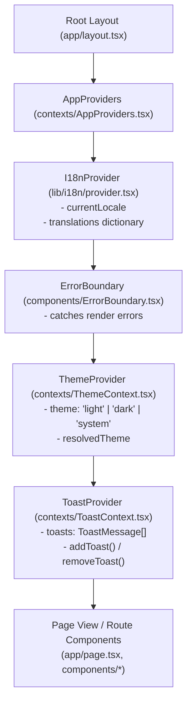
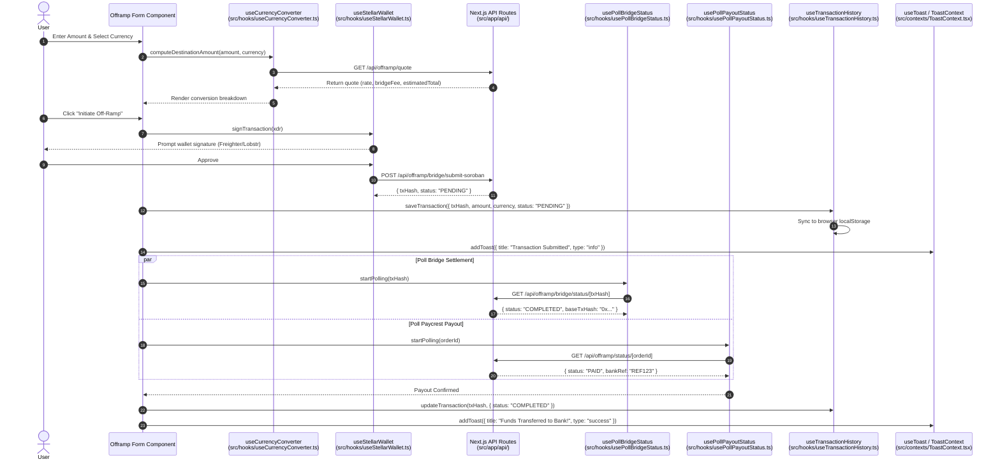
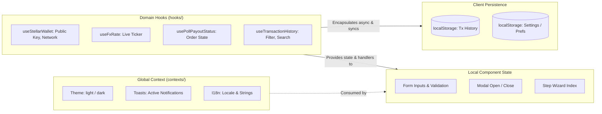

# Architecture & Data Flow: State Management

This document visualizes the state management architecture and data flows across the Stellar-Spend application as defined in [ADR-013](../adr/ADR-013-state-management-architecture.md).

---

## 1. Provider Tree & Context Hierarchy

All global context providers are encapsulated within `AppProviders` and wrapped around the React tree.

---

## 2. Off-Ramp State Flow (Hooks & Services)

Data flow during a transaction lifecycle, illustrating how hooks orchestrate wallet interaction, API polling, and local storage updates.

---

## 3. Tiered State Boundaries

